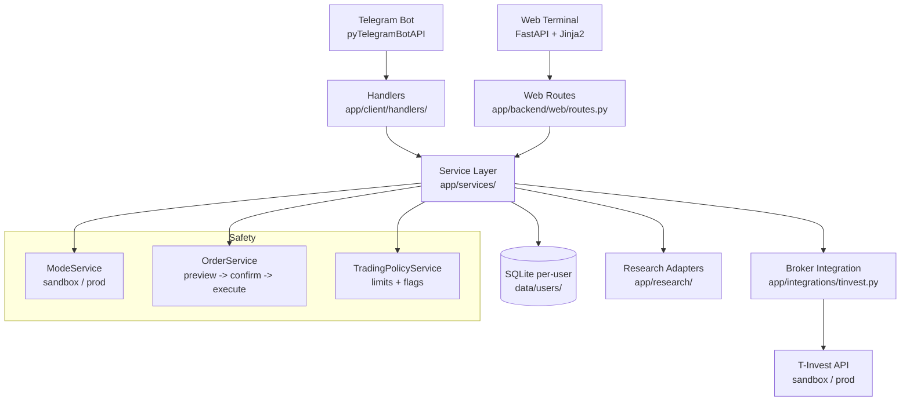

# Tbot v1 - локальный помощник долгосрочного инвестора

Tbot v1 - это локальный помощник для частного долгосрочного инвестора, построенный по принципу "сначала sandbox". Основной интерфейс - Telegram, локальный backend и веб-терминал работают на FastAPI, данные хранятся в SQLite, а для операций с портфелем, инструментами, дивидендами и ручными заявками используется T-Invest API.

Проект не является инвестиционным советником и не дает финансовых рекомендаций. Торговля в production считается опасной и остается заблокированной, пока явно не настроены `APP_MODE="prod"`, production-токен активного пользователя и `ALLOW_PROD_TRADING="true"`.

## Что умеет проект

- Показывает портфель и текущие позиции.
- Поддерживает ручную покупку и продажу по тикеру и количеству лотов.
- Ведет watchlist тикеров.
- Показывает информацию, связанную с дивидендами, для инструментов из watchlist.
- Показывает базовую текстовую статистику по сохраненным ручным торговым операциям.
- Может готовить предложения инвестиционного плана и опциональные ежедневные напоминания инвестору без сигналов и торговых советов.
- Предоставляет локальный FastAPI/web-терминал для портфеля, watchlist, дивидендов, ручных заявок, планов и настроек.
- По умолчанию запускается в sandbox-режиме.

Investor v1 намеренно не включает runtime-сигналы RSI/MACD/EMA/SMA, GPT/LSTM-анализ, скальпинг-сценарии, рекомендации BUY/HOLD/SELL/WATCH/AVOID и автоматическое исполнение брокерских заявок. Ручные заявки - единственный активный путь выставления заявок.

## Архитектура



Ключевые runtime-потоки:

- Торговля: Telegram -> Handler -> OrderService -> preview -> confirm -> TInvestBroker.
- Web: Browser -> FastAPI Route -> WebRequestServices -> Service -> DB/Broker.
- Multi-user: chat_id -> UserContextResolver -> UserContext -> per-user SessionFactory.

## Установка

Используйте Python 3.12, если он доступен. Рекомендуемая установка investor v1 использует только активный набор runtime-зависимостей:

```powershell
python -m venv venv
.\venv\Scripts\Activate.ps1
python -m pip install --upgrade pip
python -m pip install -r requirements-base.txt
```

Стандартные compatibility-алиасы также устанавливают только активные зависимости runtime v1 и не включают опциональные legacy-пакеты:

```powershell
python -m pip install -r requirements.txt
python -m pip install -r requirements-v1.txt
```

Опциональные legacy-зависимости для аналитики, графиков, сигналов, ML и GPT не входят в активный runtime investor v1. Устанавливайте их только при явной работе с изолированными legacy-модулями:

```powershell
python -m pip install -r requirements-optional.txt
```

Инструменты для разработки:

```powershell
python -m pip install -r requirements-dev.txt
```

Legacy-пакеты T-Invest SDK, используемые здесь, находятся на PyPI в quarantine-состоянии, поэтому `requirements-base.txt` фиксирует их через прямые ссылки на PyPI wheel. Перед production-использованием эти фиксации нужно пересмотреть.

## Настройка `.env` и пользователей

Скопируйте пример и заполните в `.env` только локальные секреты:

```powershell
Copy-Item .env.example .env
```

Скопируйте пример пользовательской конфигурации и заполните локальные секреты каждого пользователя в `users.json`:

```powershell
Copy-Item users.example.json users.json
```

Обязательные значения уровня приложения для sandbox v1:

```env
BOT_TOKEN = "your_telegram_bot_token"
USERS_CONFIG_PATH = "users.json"
DEFAULT_WEB_USER_ID = "default"
APP_MODE = "sandbox"
ALLOW_PROD_TRADING = "false"
ENABLE_BACKGROUND_SCHEDULERS = "false"
ENABLE_INVESTOR_REMINDERS = "false"
INVESTOR_REMINDER_TIME = "09:00"
API_BASE_URL = "http://localhost:8000"
```

У каждого пользователя в `users.json` есть собственные `telegram_chat_id`, `sandbox_token`, production-`token`, `broker_fee` и путь к пользовательской SQLite-базе `db_path`. `users.json` игнорируется git и не должен содержать секреты, которые можно передавать другим людям.

`CHAT_ID`, `SANDBOX_TOKEN`, `TOKEN` и `BROKER_FEE` в `.env` остаются временным legacy-fallback, если `users.json` не настроен. Новая multi-user-настройка должна использовать `users.json`.

`INVEST_MODE="sandbox"` может оставаться legacy-алиасом, но основной переменной режима является `APP_MODE`. Production-токен требуется только для production-режима.

Для production-торговли требуются все эти значения:

```env
APP_MODE = "prod"
ALLOW_PROD_TRADING = "true"
```

У активного пользователя в `users.json` также должен быть указан production-`token`.

## Запуск в sandbox

```powershell
python app/run.py
```

Путь запуска:

1. Проверить обязательные переменные окружения и настроенных пользователей.
2. Инициализировать SQLite. При использовании `users.json` каждый включенный пользователь получает собственный настроенный файл БД.
3. Запустить FastAPI на `http://localhost:8000`.
4. Настроить выключенные по умолчанию schedulers/reminders.
5. Запустить Telegram polling.

`ENABLE_STRATEGY_SCHEDULER` намеренно игнорируется в investor v1; legacy-автоматизацию стратегий нельзя повторно включить через `.env`.

Smoke-проверки после запуска:

```powershell
curl http://localhost:8000/
curl http://localhost:8000/api/instruments/
```

## Покупка и продажа по тикеру

В Telegram:

```text
/start
/help
```

Меню:

- `Portfolio`
- `Buy`
- `Sell`
- `Dividends`
- `Watchlist`
- `Stats`
- `Reports`
- `Help`

Ручная торговля:

```text
buy SBER 1
sell SBER 1
```

Эти команды создают только предварительный просмотр заявки. Чтобы отправить заявку после проверки preview, отправьте:

```text
confirm_order <preview_token>
```

В production-режиме команда подтверждения также должна включать тикер, показанный в preview:

```text
confirm_order <preview_token> SBER
```

Чтобы отменить preview, отправьте `cancel_order <preview_token>`.

Можно также нажать `Buy` или `Sell`, а затем ввести:

```text
SBER 1
```

Бот определяет тикер, блокирует неоднозначные или ненайденные тикеры, проверяет доступность sandbox-счета, проверяет деньги перед покупкой, проверяет доступное количество позиции перед продажей и логирует каждую попытку ручной сделки без записи секретов. Ни одна Telegram-команда покупки или продажи не отправляет брокерскую заявку до отдельной команды подтверждения.

Read-only research по тикеру:

```text
/research SBER
research SBER
```

Telegram-команда research возвращает компактную образовательную сводку с названиями источников, идентификацией инструмента при наличии, рыночным снимком при наличии, пробелами в данных, ошибками и disclaimer о том, что это не инвестиционная рекомендация. Она не показывает runtime-рейтинги или торговые сигналы и не создает и не подготавливает брокерские заявки.

## Локальный web-терминал

FastAPI также отдает локальный терминал инвестора по адресу `http://localhost:8000/`. Web UI предназначен для спокойного просмотра портфеля и ручных сценариев:

- `Portfolio`
- `Buy`
- `Sell`
- `Dividends`
- `Watchlist`
- `Research`
- `Plans`
- `Order history` со страницы Stats
- `Settings`

Экраны планов создают определения регулярных инвестиционных планов и ручные предложения. Они не создают брокерские заявки на основе анализа или торговых сигналов.

Страница `Settings` работает в read-only-режиме. Она показывает активный режим, статус настройки токена без секретных значений, feature flags, API base URL, время напоминаний и статус безопасности инвестиционного плана. Чтобы изменить эти значения, отредактируйте `.env` и перезапустите приложение.

В Phase 1 web-аутентификация не используется. Активный локальный web-пользователь выбирается через `DEFAULT_WEB_USER_ID`; если он не задан, используется первый включенный пользователь из `users.json`. Маршруты web-терминала и подключенные user-data API endpoints создают сервисы для этого пользователя и читают/пишут его настроенный SQLite-файл.

Read-only research по тикеру доступен на `http://localhost:8000/api/research`. Введите тикер, чтобы вызвать `GET /api/research/{ticker}` и показать JSON частичного research-отчета. Отчет включает источники, metadata свежести, поля локального профиля компании при настройке, `data_gaps`, `errors`, образовательный disclaimer и пустой или null `educational_rating`. Этот research entry не создает брокерские заявки, не предоставляет торговые сигналы и не рекомендует сделки. Telegram также открывает тот же read-only research flow через `/research SBER` или `research SBER`.

В sandbox-режиме read-only T-Invest research выбирает `SANDBOX_TOKEN`; отсутствующие или невалидные выбранные токены попадают в `errors` без вывода значений токена.

Локальные данные профиля компании/фундаментальных показателей загружаются из `app/research/data/local_fundamentals.json` через read-only `LocalFundamentalsAdapter`. Файл опциональный и намеренно неполный: отсутствующие тикеры или поля указываются как `data_gaps`, а не додумываются. Не храните токены, API-ключи или другие секреты в локальных research-данных.

Сгенерированные API-отчеты сохраняются как локальные read-only snapshots, если доступна SQLite. Используйте `GET /api/research/snapshots` или `GET /api/research/snapshots?ticker=SBER`, чтобы посмотреть последние snapshots, и `GET /api/research/snapshots/{id}`, чтобы открыть один сохраненный отчет.

## Статус legacy-кода

Старые модули сигналов, стратегий, ML, GPT/LSTM, графиков и market-notifications остаются в репозитории как legacy-код для безопасности миграции и обратимости. Они не входят в активное меню investor v1 или активный API router, и этот runtime v1 нельзя считать ботом для автоторговли или сигналов.

## Известные ограничения

- Полная runtime-валидация требует реальные учетные данные Telegram и T-Invest sandbox.
- Цены ручных заявок берутся из текущего стакана и могут не сработать, если стакан пуст или рынок недоступен.
- История ручных заявок хранит ограниченные metadata; часть статистики считается за все время, а не по интервалу.
- Multi-user-поддержка Phase 1 вводится постепенно: `users.json`, user resolution, per-user service DB routing и активная маршрутизация Telegram/web/API request уже есть. Изолированные legacy-handlers все еще используют старые пути хранения, пока они не будут мигрированы или удалены.
- Опциональные напоминания инвестору требуют `APScheduler` из `requirements-base.txt` и по умолчанию выключены.
- Legacy-модули сигналов, стратегий, ML, GPT/LSTM, графиков и market-notifications остаются в репозитории для обратимости, но не входят в активный runtime investor v1.
- Pydantic v2 выводит предупреждение для старой schema-конфигурации `orm_mode`; это не блокирует работу.

## Дополнительная документация

- `README_LOCAL_SETUP.md` - настройка ноутбука на Windows.
- `INVESTOR_MODE.md` - workflow investor-mode.
- `V1_SCOPE.md` - scope функций v1.
- `MIGRATION_AUDIT.md` - заметки аудита миграции.
