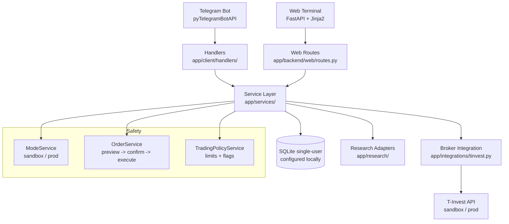

# Tbot v1 - локальный помощник долгосрочного инвестора

Tbot v1 - это локальный помощник для одного уникального частного долгосрочного инвестора, построенный по принципу "сначала sandbox". Основной интерфейс - Telegram, локальный backend и веб-терминал работают на FastAPI, данные хранятся в SQLite, а для операций с портфелем, инструментами, дивидендами и ручными заявками используется T-Invest API.

Проект не рассчитан как multi-user SaaS или общий бот для нескольких людей. `users.json` и `UserContext` используются как локальная конфигурационная оболочка для единственного владельца: его Telegram chat ID, T-Invest токенов, комиссии брокера и пути к локальной SQLite-базе.

В развитие основной идеи проект должен также давать инвестору возможность видеть текущие торговые стратегии в веб-терминале и Telegram-боте. Этот слой по умолчанию read-only: показывает название, статус, инструменты, правила и последние проверки стратегии. Локальные strategy proposals можно включить только явно; они отправляют Telegram-предложение на подтверждение и не создают брокерскую заявку без отдельного пользовательского подтверждения и свежей проверки перед исполнением.

Проект не является инвестиционным советником и не дает финансовых рекомендаций. Торговля в production считается опасной и остается заблокированной, пока явно не настроены `APP_MODE="prod"`, production-токен активного пользователя и `ALLOW_PROD_TRADING="true"`.

## Что умеет проект

- Показывает портфель и текущие позиции.
- Поддерживает ручную покупку и продажу по тикеру и количеству лотов.
- Ведет watchlist тикеров.
- Показывает информацию, связанную с дивидендами, для инструментов из watchlist.
- Показывает базовую текстовую статистику по сохраненным ручным торговым операциям.
- Может готовить предложения инвестиционного плана, включая ежедневное условие покупки ниже вчерашней средней цены, anti-greedy предложения продажи при прибыли по позиции выше порога, явно включенные локальные strategy proposals через Telegram confirmation, и опциональные ежедневные напоминания инвестору без сигналов и торговых советов.
- Предоставляет локальный FastAPI/web-терминал для портфеля, watchlist, дивидендов, ручных заявок, планов, read-only стратегий и настроек.
- По умолчанию запускается в sandbox-режиме.

Investor v1 намеренно не включает runtime-сигналы RSI/MACD/EMA/SMA, GPT/LSTM-анализ, скальпинг-сценарии и рекомендации BUY/HOLD/SELL/WATCH/AVOID. Активные пути выставления заявок проходят через `OrderService` preview -> confirmation -> execute; плановые, anti-greedy и strategy proposal предложения требуют явного подтверждения. Отдельный тип стратегий `auto_execute` существует только как явно включаемый sandbox-only milestone с лимитами, дедупликацией и запретом прямых broker calls.

## Архитектура



Ключевые runtime-потоки:

- Торговля: Telegram -> Handler -> OrderService -> preview -> confirm -> TInvestBroker.
- Web: Browser -> FastAPI Route -> WebRequestServices -> Service -> DB/Broker.
- User context: Telegram chat_id -> UserContextResolver -> single configured UserContext -> SessionFactory.

## Установка

**Python 3.12 is the canonical supported version for this project. Python 3.13/3.14 are not currently tested.**

Рекомендуемая установка investor v1 использует только активный набор runtime-зависимостей:

```powershell
python -m venv venv
.\venv\Scripts\Activate.ps1
python -m pip install --upgrade pip
python -m pip install -r requirements-base.txt
```

Стандартные compatibility-алиасы также устанавливают только активные зависимости runtime v1 и не включают опциональные legacy-пакеты:

```powershell
python -m pip install -r requirements.txt
python -m pip install -r requirements-v1.txt
```

Опциональные legacy-зависимости для аналитики, графиков, сигналов, ML и GPT не входят в активный runtime investor v1. Устанавливайте их только при явной работе с изолированными legacy-модулями:

```powershell
python -m pip install -r requirements-optional.txt
```

Инструменты для разработки:

```powershell
python -m pip install -r requirements-dev.txt
```

Legacy-пакеты T-Invest SDK, используемые здесь, находятся на PyPI в quarantine-состоянии, поэтому `requirements-base.txt` фиксирует их через прямые ссылки на PyPI wheel. Перед production-использованием эти фиксации нужно пересмотреть.

## Настройка `.env` и пользователя

Скопируйте пример и заполните в `.env` только локальные секреты:

```powershell
Copy-Item .env.example .env
```

Скопируйте пример пользовательской конфигурации и заполните локальные секреты единственного пользователя в `users.json`:

```powershell
Copy-Item users.example.json users.json
```

Обязательные значения уровня приложения для sandbox v1:

```env
BOT_TOKEN = "your_telegram_bot_token"
USERS_CONFIG_PATH = "users.json"
DEFAULT_WEB_USER_ID = "default"
APP_MODE = "sandbox"
ALLOW_PROD_TRADING = "false"
WEB_AUTH_ENABLED = "false"
WEB_AUTH_TOKEN = ""
ENABLE_LEGACY_LOCAL_WRITE_API = "false"
ENABLE_BACKGROUND_SCHEDULERS = "false"
ENABLE_INVESTOR_REMINDERS = "false"
INVESTOR_REMINDER_TIME = "09:00"
ENABLE_STRATEGY_PROPOSALS = "false"
STRATEGY_CONFIRMATION_REQUIRED_DIR = "user_strategies/confirmation_required"
STRATEGY_PROPOSALS_DIR = ""
ENABLE_STRATEGY_OBSERVATIONS = "false"
STRATEGY_NO_CONFIRMATION_DIR = "user_strategies/observations"
ENABLE_STRATEGY_OBSERVATION_TELEGRAM_NOTIFICATIONS = "false"
STRATEGY_PROPOSAL_CHECK_INTERVAL_SECONDS = "60"
ENABLE_STRATEGY_AUTO_EXECUTION = "false"
ALLOW_STRATEGY_AUTO_EXECUTION = "false"
STRATEGY_AUTO_EXECUTION_SANDBOX_ONLY = "true"
STRATEGY_AUTO_EXECUTION_DIR = "user_strategies/auto_execute"
STRATEGY_AUTO_EXECUTION_CHECK_INTERVAL_SECONDS = "60"
STRATEGY_AUTO_DEDUPE_WINDOW_SECONDS = "86400"
MAX_STRATEGY_AUTO_ORDER_RUB = "0"
MAX_DAILY_STRATEGY_AUTO_RUB = "0"
API_BASE_URL = "http://localhost:8000"
```

В `users.json` должен быть настроен один включенный пользователь: его `telegram_chat_id`, `sandbox_token`, production-`token`, `broker_fee` и путь к локальной SQLite-базе `db_path`. `users.json` игнорируется git и не должен содержать секреты, которые можно передавать другим людям.

`CHAT_ID`, `SANDBOX_TOKEN`, `TOKEN` и `BROKER_FEE` в `.env` остаются временным legacy-fallback, если `users.json` не настроен. Предпочтительная настройка единственного локального пользователя должна использовать `users.json`.

`INVEST_MODE="sandbox"` может оставаться legacy-алиасом, но основной переменной режима является `APP_MODE`. Production-токен требуется только для production-режима.

Для production-торговли требуются все эти значения:

```env
APP_MODE = "prod"
ALLOW_PROD_TRADING = "true"
```

У единственного активного пользователя в `users.json` также должен быть указан production-`token`.

## Запуск в sandbox

```powershell
python app/run.py
```

Путь запуска:

1. Проверить обязательные переменные окружения и единственного настроенного пользователя.
2. Инициализировать SQLite. При использовании `users.json` единственный включенный пользователь получает свой настроенный файл БД.
3. Запустить FastAPI на `http://localhost:8000`.
4. Настроить выключенные по умолчанию schedulers/reminders.
5. Запустить Telegram polling.

`ENABLE_STRATEGY_SCHEDULER` намеренно игнорируется в investor v1; legacy-автоматизацию стратегий нельзя повторно включить через `.env`.

Smoke-проверки после запуска:

```powershell
curl http://localhost:8000/
curl http://localhost:8000/api/instruments/
```

## Покупка и продажа по тикеру

В Telegram:

```text
/start
/help
```

Меню:

- `Portfolio`
- `Buy`
- `Sell`
- `Dividends`
- `Watchlist`
- `Stats`
- `Reports`
- `Help`

Ручная торговля:

```text
buy SBER 1
sell SBER 1
```

Эти команды создают только предварительный просмотр заявки. Чтобы отправить заявку после проверки preview, отправьте:

```text
confirm_order <preview_token>
```

В production-режиме команда подтверждения также должна включать тикер, показанный в preview:

```text
confirm_order <preview_token> SBER
```

Чтобы отменить preview, отправьте `cancel_order <preview_token>`.

Можно также нажать `Buy` или `Sell`, а затем ввести:

```text
SBER 1
```

Бот определяет тикер, блокирует неоднозначные или ненайденные тикеры, проверяет доступность sandbox-счета, проверяет деньги перед покупкой, проверяет доступное количество позиции перед продажей и логирует каждую попытку ручной сделки без записи секретов. Ни одна Telegram-команда покупки или продажи не отправляет брокерскую заявку до отдельной команды подтверждения.

Read-only research по тикеру:

```text
/research SBER
research SBER
```

Telegram-команда research возвращает компактную образовательную сводку с названиями источников, идентификацией инструмента при наличии, рыночным снимком при наличии, пробелами в данных, ошибками и disclaimer о том, что это не инвестиционная рекомендация. Она не показывает runtime-рейтинги или торговые сигналы и не создает и не подготавливает брокерские заявки.

## Локальный web-терминал

FastAPI также отдает локальный терминал инвестора по адресу `http://localhost:8000/`. Web UI предназначен для спокойного просмотра портфеля и ручных сценариев:

- `Portfolio`
- `Buy`
- `Sell`
- `Dividends`
- `Watchlist`
- `Research`
- `Plans`
- `Strategies`
- `Order history` со страницы Stats
- `Settings`

Экраны планов создают определения регулярных инвестиционных планов и ручные предложения. Они не создают брокерские заявки на основе анализа или торговых сигналов.

Для ежедневной покупки по условию можно создать plan с `Schedule = Daily` и `Price rule = Yesterday average minus percent`. Значение по умолчанию `Percent threshold = 0.5` означает: проверять текущую цену покупки и продолжать только если она не выше `вчерашняя дневная OHLC-средняя * 0.995`. Если `ENABLE_BACKGROUND_SCHEDULERS=true` и `ENABLE_INVESTMENT_PLANS=true`, scheduler проверяет такие планы в заданное время и отправляет Telegram-подтверждение. Брокерская заявка все равно отправляется только после явного подтверждения; перед исполнением цена и условие проверяются повторно.

Anti-greedy policy включается отдельно через `ENABLE_ANTI_GREEDY_POLICY=true`. По умолчанию `ANTI_GREEDY_PROFIT_PCT=20`: ежедневная проверка в `ANTI_GREEDY_CHECK_TIME` находит позиции, где текущая валовая доходность выше 20%, и отправляет Telegram-подтверждение на продажу позиции в целых лотах. Заявка не отправляется без явного подтверждения, а перед исполнением позиция, порог прибыли и sell preview с проверкой доступного количества проверяются заново.

Local confirmation-required strategy proposals включаются отдельно через `ENABLE_STRATEGY_PROPOSALS=true` и работают только если также включен общий gate `ENABLE_BACKGROUND_SCHEDULERS=true`. Scheduler загружает enabled strategy files из `STRATEGY_CONFIRMATION_REQUIRED_DIR` (по умолчанию `user_strategies/confirmation_required`), планирует проверки по `schedule` внутри стратегии и отправляет Telegram-prompt с кнопками `Исполнить` / `Пропустить`. `STRATEGY_PROPOSALS_DIR` остается только deprecated alias для старых локальных настроек; для новых настроек используйте `STRATEGY_CONFIRMATION_REQUIRED_DIR`. Брокерская заявка не отправляется при срабатывании стратегии: подтверждение создает fresh `OrderService.preview()`, выполняет recheck стратегии, если он включен, и только затем идет через `OrderService.execute()`. Результаты проверок и подтверждений сохраняются в локальную таблицу истории без raw broker/API payloads и без секретов.

No-confirmation strategies включаются отдельно через `ENABLE_STRATEGY_OBSERVATIONS=true` и загружаются из `STRATEGY_NO_CONFIRMATION_DIR` (по умолчанию `user_strategies/observations`). Это observation-only проверки: они могут записать локальную историю/status и, если `ENABLE_STRATEGY_OBSERVATION_TELEGRAM_NOTIFICATIONS=true`, отправить informational Telegram notification. Они никогда не создают broker-order proposals, не вызывают `OrderService.preview()`, не вызывают `OrderService.execute()` и не отправляют брокерские заявки.

Auto-execute strategies являются отдельным, выключенным по умолчанию типом стратегий. Они загружаются только из `STRATEGY_AUTO_EXECUTION_DIR` (по умолчанию `user_strategies/auto_execute`) и запускаются только если одновременно включены `ENABLE_BACKGROUND_SCHEDULERS=true`, `ENABLE_STRATEGY_AUTO_EXECUTION=true` и `ALLOW_STRATEGY_AUTO_EXECUTION=true`. Production auto-execution заблокирован независимо от `STRATEGY_AUTO_EXECUTION_SANDBOX_ONLY`; этот флаг оставлен только для совместимости/отображения. Перед исполнением создается fresh `OrderService.preview()`, затем проверяются `MAX_ORDER_RUB`, `MAX_DAILY_INVEST_RUB`, `MAX_STRATEGY_AUTO_ORDER_RUB`, `MAX_DAILY_STRATEGY_AUTO_RUB` и durable dedupe. Дневной strategy auto budget резервируется атомарно в SQLite перед `OrderService.execute()`, поэтому параллельные разные стратегии не могут превысить эффективный дневной лимит. Preview/policy failures consume dedupe conservatively for the day and are not retried automatically by the scheduler. Заявка отправляется только через `OrderService.execute()`. Scheduler, registry, dashboard и strategy files не вызывают broker order APIs напрямую. Каждое решение и terminal outcome записывается в local strategy history.

Страница `Strategies` работает в read-only-режиме. Она показывает feature flags, пути `STRATEGY_CONFIRMATION_REQUIRED_DIR`, `STRATEGY_NO_CONFIRMATION_DIR` и `STRATEGY_AUTO_EXECUTION_DIR`, загруженные confirmation-required, observation-only и auto-execute стратегии, безопасно отредактированные ошибки загрузки и последние записи strategy history. На странице нет кнопок запуска, редактирования, удаления или исполнения стратегий.

Страница `Settings` работает в read-only-режиме. Она показывает активный режим, статус настройки токена без секретных значений, feature flags, API base URL, время напоминаний, статус безопасности инвестиционного плана, strategy proposal config, количество загруженных стратегий, ошибки загрузки и краткий статус локальной истории. Чтобы изменить эти значения, отредактируйте `.env` и перезапустите приложение.

Web-аутентификация опциональна для локального `API_HOST="127.0.0.1"` / `localhost`: `WEB_AUTH_ENABLED` может оставаться `false`. Если FastAPI слушает `0.0.0.0` или другой не-localhost адрес, startup блокируется, пока `WEB_AUTH_ENABLED="true"` и `WEB_AUTH_TOKEN` не заданы. При включенной авторизации web-терминал и `/api/*` требуют `Authorization: Bearer <WEB_AUTH_TOKEN>` или cookie `web_auth_token`; `/static/*` и `/api/health` остаются открытыми. Значение токена не выводится в Settings, логах или ошибках.

Server-rendered web forms защищены CSRF-токеном: web-страницы получают HttpOnly cookie `web_csrf_token`, формы отправляют скрытое поле `csrf_token`, а POST-запросы сверяют оба значения и проверяют `Origin`/`Referer`, когда эти заголовки присутствуют. Когда запрос приходит по HTTPS (включая `X-Forwarded-Proto: https`), cookie выставляется с атрибутом `Secure`.

Legacy `/api/trading/*` и `/api/instruments/*` write-эндпоинты (`POST` и `DELETE`) отключены по умолчанию. Эти эндпоинты не отправляют брокерские заявки, но раньше позволяли записывать в локальную SQLite без CSRF, если `WEB_AUTH_ENABLED=false`. Они теперь возвращают `403`, если не задано `ENABLE_LEGACY_LOCAL_WRITE_API="true"`. Read-only `GET`-эндпоинты остаются доступными. Включайте флаг только если вы умышленно используете legacy local-write API и понимаете, что он не защищён CSRF.

Strategy directories (`STRATEGY_CONFIRMATION_REQUIRED_DIR`, `STRATEGY_NO_CONFIRMATION_DIR`, `STRATEGY_AUTO_EXECUTION_DIR`) — это исполняемые пути кода: загруженный файл импортируется и его функции вызываются runtime'ом стратегий. Эти каталоги должны быть owner-write-only (например, NTFS-права только для текущего пользователя или `chmod 0700`) и содержать только проверенный локальный код. Не помещайте в них файлы из недоверенных источников.

Local LLM/research/rating output (включая будущие BUY/HOLD/SELL/WATCH/AVOID-метки) остаётся образовательным non-advisory analysis: он никогда не вызывает `OrderService.preview()` или `OrderService.execute()` напрямую и не создаёт брокерские заявки. Tbot v1 остаётся sandbox-first и manual-order-only.

Активный локальный web-пользователь выбирается через `DEFAULT_WEB_USER_ID`; для целевого режима проекта это должен быть единственный включенный пользователь из `users.json`. Маршруты web-терминала и подключенные user-data API endpoints создают сервисы для этого пользователя и читают/пишут его настроенный SQLite-файл.

Read-only research по тикеру доступен на `http://localhost:8000/api/research`. Введите тикер, чтобы вызвать `GET /api/research/{ticker}` и показать JSON частичного research-отчета. Отчет включает источники, metadata свежести, поля локального профиля компании при настройке, `data_gaps`, `errors`, образовательный disclaimer и пустой или null `educational_rating`. Этот research entry не создает брокерские заявки, не предоставляет торговые сигналы и не рекомендует сделки. Telegram также открывает тот же read-only research flow через `/research SBER` или `research SBER`.

В sandbox-режиме read-only T-Invest research выбирает `SANDBOX_TOKEN`; отсутствующие или невалидные выбранные токены попадают в `errors` без вывода значений токена.

Локальные данные профиля компании/фундаментальных показателей загружаются из `app/research/data/local_fundamentals.json` через read-only `LocalFundamentalsAdapter`. Файл опциональный и намеренно неполный: отсутствующие тикеры или поля указываются как `data_gaps`, а не додумываются. Не храните токены, API-ключи или другие секреты в локальных research-данных.

Сгенерированные API-отчеты сохраняются как локальные read-only snapshots, если доступна SQLite. Используйте `GET /api/research/snapshots` или `GET /api/research/snapshots?ticker=SBER`, чтобы посмотреть последние snapshots, и `GET /api/research/snapshots/{id}`, чтобы открыть один сохраненный отчет.

## Статус legacy-кода

Старые модули сигналов, стратегий, ML, GPT/LSTM, графиков и market-notifications остаются в репозитории как legacy-код для безопасности миграции и обратимости. Они не входят в активное меню investor v1 или активный API router, и этот runtime v1 нельзя считать ботом для автоторговли или сигналов.

## Известные ограничения

- Полная runtime-валидация требует реальные учетные данные Telegram и T-Invest sandbox.
- Цены ручных заявок берутся из текущего стакана и могут не сработать, если стакан пуст или рынок недоступен.
- История ручных заявок хранит ограниченные metadata; часть статистики считается за все время, а не по интервалу.
- Проект целится в одного уникального пользователя. Существующая `users.json`/`UserContext` инфраструктура используется для локальной конфигурации и routing этого пользователя, а не как multi-user продуктовая модель.
- Опциональные напоминания инвестору требуют `APScheduler` из `requirements-base.txt` и по умолчанию выключены.
- Legacy-направления сигналов, стратегий, ML, GPT/LSTM, графиков и market-notifications не входят в активный runtime investor v1. Optional legacy dependencies остаются только в `requirements-optional.txt`.
- Pydantic v2 выводит предупреждение для старой schema-конфигурации `orm_mode`; это не блокирует работу.

## Дополнительная документация

- `PROJECT_RUNBOOK.md` - команды запуска, ежедневная эксплуатация и обзор функций проекта.
- `README_LOCAL_SETUP.md` - настройка ноутбука на Windows.
- `INVESTOR_MODE.md` - workflow investor-mode.
- `V1_SCOPE.md` - scope функций v1.
- `RESEARCH_TERMINAL_FOUNDATION.md` - foundation для read-only research terminal.
- `docs/repository_cleanup_audit.md` - отчет по cleanup-аудиту репозитория.
