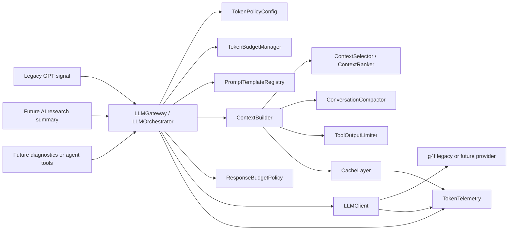
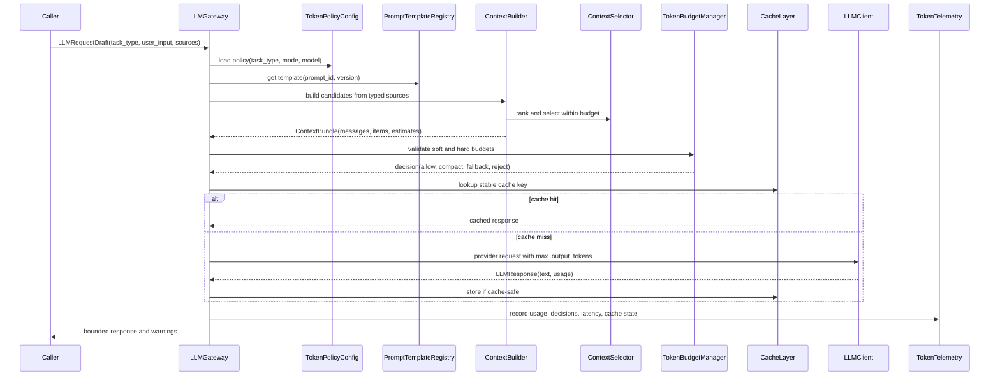
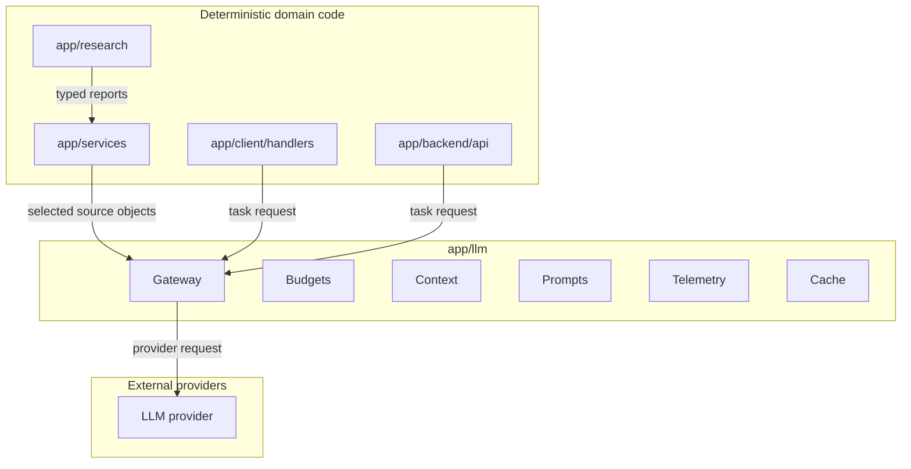

# Token Optimization Architecture

Status: proposed architecture  
Scope: Tbot repository as of 2026-05-13  
Primary goal: reduce token usage without reducing answer quality, safety, or system behavior.

## Executive summary

The current codebase does not have a broad active LLM layer. The only direct model call found is the legacy optional GPT signal path in `app/client/signals/gpt_signal.py`, which sends a single unbounded user message to `g4f.models.gpt_4o_mini`. The active Investor v1 research flow is deterministic: `app/research/*`, Telegram handlers, and FastAPI endpoints build structured reports and formatted messages without passing data to a model.

That current state is useful: token optimization can be introduced as a contained architecture before LLM usage spreads. The highest-risk future token sources are the structured research reports and snapshots, broker/API JSON payloads, logs, Telegram message histories if they are later stored as text, and any future agent/tool execution outputs. The architecture below creates a central LLM boundary that measures, filters, ranks, compacts, budgets, caches, and logs every model request.

The proposed design adds a small `app/llm/` package and keeps `app/research/` deterministic. Research and trading modules should supply structured data to the LLM boundary; they should not build raw prompts themselves. The first implementation phase should focus on observability and guardrails, not semantic retrieval or model routing.

## Current state analysis

### LLM and prompt inventory

| Area | File | Current behavior | Token relevance |
| --- | --- | --- | --- |
| Legacy GPT signal | `app/client/signals/gpt_signal.py` | Builds prompt by appending `profit` and `ticker` to arbitrary `text`; calls `Client().chat.completions.create(model=g4f.models.gpt_4o_mini, messages=[{"role": "user", "content": text}])`; prints raw response. | Only direct LLM call found. Unbounded input, no system prompt, no output cap, no telemetry, no cache, no retry policy, no context selection. |
| Optional dependencies | `requirements-optional.txt` | Contains `g4f==0.3.2.9` as a legacy optional dependency. | Confirms the LLM path is optional legacy, not part of default install. |
| Dependency tests | `tests/test_dependency_files.py` | Prevents optional legacy packages from entering default requirements and Docker/bootstrap flows. | Important migration guard: new token architecture should avoid making heavy LLM dependencies default. |
| Research isolation tests | `tests/test_research_foundation.py`, `tests/test_research_api.py` | Assert `app/research` and research API do not import legacy signal/order/LLM modules. | Preserve this boundary. Add LLM usage outside `app/research`. |
| Research services | `app/research/services.py` | Deterministically assembles `ResearchReport` from adapters. | Future LLM summaries should consume a selected projection of `ResearchReport`, not full raw JSON. |
| Research schemas | `app/research/schemas.py` | Structured dataclasses with profile, financials, dividends, competitors, macro context, news/OSINT, gaps, errors. | Likely future model context source; can grow large. |
| Research snapshots | `app/research/snapshots.py` | Persists full `report_json`; list endpoint can return full reports for many snapshots. | High-potential large JSON source if snapshots are later fed to an LLM or debugging agent. |
| Research API | `app/backend/api/endpoints/research.py` | Returns full report JSON and recent snapshots. | Useful source data, but should not be passed raw into prompts. |
| Telegram research handler | `app/client/handlers/research/research_handler.py` | Formats report sections into Telegram text. | Not an LLM call today; message text can become large if reused as prompt context. |
| Manual order handler | `app/client/handlers/orders/manual_order_handler.py` | Stores preview state in memory; sends formatted Telegram confirmations. | Conversation-like state, but not model history. Must stay out of LLM prompts unless explicitly selected and redacted. |
| Telegram message utilities | `app/client/handlers/utils/message_utils.py` | Stores last Telegram message IDs, not text history. | No model history store today. |
| API client | `app/client/api/base_client.py` | Returns complete JSON responses from HTTP calls. | Needs output shaping if API responses are ever used as tool/model context. |
| Logging | `app/client/log/logger.py` | Writes logs to file and console. | Logs can grow without bound; any future agent should read logs through an output limiter. |
| Runtime config | `app/client/config/__init__.py` | Contains app, broker, scheduler, plan, and token settings for non-LLM services. | No LLM model, budget, temperature, response, or telemetry config exists. |

### Context and history storage

There is no general conversation history store currently passed to a model. Existing state is operational:

- `last_messages` stores Telegram message IDs only.
- Manual order and plan confirmation flows store in-memory preview or confirmation data, not reusable model context.
- Research snapshots store structured reports for API/user retrieval.

If future chat-like LLM behavior is added, history storage must be explicitly designed. It should not reuse Telegram messages wholesale.

### Model settings, retries, streaming, and limits

The only direct LLM call does not set:

- system/developer prompt;
- temperature;
- max input budget;
- max output tokens;
- streaming behavior;
- retry/backoff policy;
- timeout;
- provider fallback;
- usage telemetry;
- cache policy;
- response schema;
- safety or trading boundary instructions.

No central model configuration exists.

### Large payload entry points

The following are not model contexts today, but are the main payloads that could become token hotspots:

- `ResearchReport` and nested adapter outputs.
- Research snapshot list/detail JSON.
- Broker and local fundamentals adapter data.
- HTTP API responses returned by `BaseApiClient`.
- Log files under `app/client/log/`.
- Project task documents such as `AUTO_SCHEDULE_TASKS.md`, when used as agent context.
- Future shell/tool outputs if an agent mode is added to the project.

## Token-cost hotspot map

| Hotspot | Current evidence | Waste mode | Severity if LLM usage grows | Recommended control |
| --- | --- | --- | --- | --- |
| Legacy GPT signal prompt | `calculate_gpt_strategy(text, profit, ticker)` appends data to arbitrary text. | Unbounded prompt; no deduplication; no role separation; no response limit. | High | Route through `LLMClient`, `PromptTemplateRegistry`, `TokenBudgetManager`, and `ResponseBudgetPolicy`. |
| Full research report JSON | `ResearchReport` can include profile, financials, competitors, macro, news, gaps, errors. | Raw JSON can include irrelevant fields and repeated metadata. | High | `ContextBuilder` should create task-specific projections. |
| Snapshot list payloads | `list_recent()` includes full `report_json` per snapshot. | Many full reports can enter diagnostics or future prompts. | High | Add list/detail separation for model context; cap snapshot count and fields. |
| Tool/API outputs | `BaseApiClient` returns full JSON. | Full responses passed to future agents or LLM tools. | Medium/high | `ToolOutputLimiter` for JSON, text, logs, and HTTP bodies. |
| Logs | File logs can grow indefinitely. | Long stack traces and repeated events dominate prompts. | Medium | Log tailing, severity filtering, deduplication, and redaction before model use. |
| Conversation history | No current model history; future chat would need it. | Unbounded message replay. | High | `ConversationCompactor` with hard history budget. |
| Prompt sprawl | Prompt logic is inline in legacy GPT path; handlers use ad hoc user text. | Duplicate instructions and inconsistent constraints. | Medium | `PromptTemplateRegistry` with versions and tests. |
| Repeated identical contexts | Research reports and snapshots are deterministic for a ticker/as-of time. | Same context repeatedly summarized. | Medium | Cache selected context projections, summaries, and safe LLM responses. |
| Verbose model responses | No output token cap in LLM call. | Excess response cost and Telegram overflow. | Medium | `ResponseBudgetPolicy` by task type and channel. |
| Missing telemetry | No usage or cost tracking. | Cannot identify p95 waste or regressions. | High | `TokenTelemetry` baseline before optimization. |
| Task decomposition | Future agents may feed entire files/logs into one call. | Large monolithic prompts. | Medium | Task classification, context selection, and staged summarization. |

## Proposed architecture

### Design principles

1. One LLM boundary: every model call goes through a small orchestration layer.
2. Structured context first: pass typed projections, not raw reports, logs, or files.
3. Budget before call: estimate tokens and apply soft/hard budgets before provider invocation.
4. Preserve research isolation: keep `app/research/` free of LLM provider imports.
5. Observability before sophistication: measure actual and estimated tokens before adding embeddings or routing.
6. Conservative defaults: LLM features disabled or limited unless configured.
7. Trading safety: never allow compactors, templates, or selectors to drop constraints around order placement and user confirmation.

### Component diagram



### Data flow



### Runtime boundaries



## Components

### TokenPolicyConfig

Purpose: central configuration for token limits, model defaults, compaction thresholds, cache behavior, and fallback policies.

Location:

- New: `app/llm/config.py`
- Optional integration: read environment in `app/client/config/__init__.py` and expose an `llm_config` factory.

Initial data shape:

```python
@dataclass(frozen=True)
class TokenPolicy:
    task_type: str
    model: str
    fallback_model: str | None
    soft_input_tokens: int
    hard_input_tokens: int
    max_output_tokens: int
    max_history_tokens: int
    max_tool_output_chars: int
    compaction_threshold_tokens: int
    cache_ttl_seconds: int
    allow_response_cache: bool
    temperature: float
```

Configuration example:

```yaml
llm:
  enabled: false
  default_model: "gpt-4o-mini"
  policies:
    legacy_signal:
      soft_input_tokens: 1500
      hard_input_tokens: 2500
      max_output_tokens: 120
      temperature: 0.2
      max_tool_output_chars: 4000
      allow_response_cache: false
    research_summary:
      soft_input_tokens: 6000
      hard_input_tokens: 9000
      max_output_tokens: 700
      temperature: 0.1
      compaction_threshold_tokens: 3000
      allow_response_cache: true
      cache_ttl_seconds: 3600
    diagnostics:
      soft_input_tokens: 8000
      hard_input_tokens: 12000
      max_output_tokens: 1000
      max_tool_output_chars: 12000
```

Migration note: start with environment variables or Python defaults to avoid adding a YAML dependency.

### TokenBudgetManager

Purpose: enforce task-specific budgets before model calls.

Location:

- New: `app/llm/budget.py`

Responsibilities:

- Estimate input tokens before provider call.
- Compare prompt, context, history, and tool-output budgets separately.
- Return a decision: allow, compact, reduce context, use fallback model, or reject.
- Attach budget decisions to telemetry.

Interface:

```python
class TokenBudgetManager:
    def evaluate(self, request: "PreparedLLMRequest", policy: TokenPolicy) -> "BudgetDecision":
        ...

@dataclass(frozen=True)
class BudgetDecision:
    allowed: bool
    action: Literal["allow", "compact", "drop_low_priority", "fallback_model", "reject"]
    estimated_input_tokens: int
    remaining_input_tokens: int
    warnings: tuple[str, ...]
```

Pseudocode:

```python
def evaluate(request, policy):
    prompt_tokens = estimate_tokens(request.system_prompt)
    message_tokens = sum(estimate_tokens(m.content) for m in request.messages)
    context_tokens = sum(item.token_estimate for item in request.context.items)
    total = prompt_tokens + message_tokens + context_tokens

    if total <= policy.soft_input_tokens:
        return allow(total)
    if total <= policy.hard_input_tokens:
        return compact_or_drop_low_priority(total)
    if policy.fallback_model:
        return fallback_model(total)
    return reject(total)
```

Initial token estimation can use a no-dependency heuristic:

```python
def estimate_tokens(text: str) -> int:
    return max(1, math.ceil(len(text) / 4))
```

When provider usage metadata is available, telemetry should store both estimated and actual token counts.

### ContextBuilder

Purpose: build the minimum sufficient model context from typed project objects.

Location:

- New: `app/llm/context.py`

Inputs:

- task type;
- user request;
- typed sources such as `ResearchReport`, snapshot IDs, selected files, logs, tool results;
- optional short conversation state;
- token policy.

Outputs:

```python
@dataclass(frozen=True)
class ContextItem:
    id: str
    source_type: str
    source_path: str | None
    title: str
    content: str
    metadata: Mapping[str, Any]
    priority: int
    token_estimate: int
    sensitivity: Literal["public", "internal", "secret"]
    last_updated: datetime | None

@dataclass(frozen=True)
class ContextBundle:
    items: tuple[ContextItem, ...]
    messages: tuple["LLMMessage", ...]
    prompt_id: str
    prompt_version: str
    estimated_input_tokens: int
    dropped_item_ids: tuple[str, ...]
    truncation_warnings: tuple[str, ...]
```

Project-specific source adapters:

- `ResearchReportContextAdapter`: converts `ResearchReport` into compact sections: identity, market snapshot, key financials, data gaps, risks, freshness. It should exclude raw nested dicts unless selected.
- `SnapshotContextAdapter`: loads a single snapshot or a bounded comparison set. Snapshot lists should use summaries only.
- `LogContextAdapter`: reads only recent relevant lines after severity filtering and redaction.
- `ToolResultContextAdapter`: accepts structured tool outputs and sends them through `ToolOutputLimiter`.
- `LegacySignalContextAdapter`: converts ticker/profit/free text into a short typed context for `legacy_signal`.

Pseudocode:

```python
def build(task_type, user_input, sources, policy):
    template = prompt_registry.get(task_type)
    candidates = []

    for source in sources:
        candidates.extend(adapter_for(source).to_context_items(source))

    limited_candidates = [
        tool_output_limiter.limit(item, policy)
        if item.source_type in {"tool", "log", "api_json"}
        else item
        for item in candidates
    ]

    selected = context_selector.select(
        query=user_input,
        candidates=limited_candidates,
        budget_tokens=policy.soft_input_tokens - template.token_estimate,
    )

    return ContextBundle(
        items=selected.items,
        messages=template.render(user_input=user_input, context=selected.items),
        prompt_id=template.id,
        prompt_version=template.version,
        estimated_input_tokens=estimate_bundle_tokens(selected),
        dropped_item_ids=selected.dropped_ids,
        truncation_warnings=selected.warnings,
    )
```

### ContextSelector / ContextRanker

Purpose: select relevant files, report sections, messages, documents, and tool outputs within budget.

Location:

- New: `app/llm/ranking.py`

Initial implementation:

- No new dependencies.
- Deterministic scoring with source priority, exact ticker match, recency, field importance, and lexical overlap.
- Hard exclusions for secrets and unrelated order/trading state.

Later implementation:

- Optional embeddings/vector retrieval for large reports, documents, or historical chats.

Ranking factors for this project:

| Factor | Example |
| --- | --- |
| Task type priority | `research_summary` prefers identity, market snapshot, financials, data gaps, freshness. |
| Ticker/entity match | Prefer context tagged with the requested ticker. |
| Freshness | Prefer latest broker/local data. |
| Safety | Always include disclaimers, unresolved gaps, and "no order placement" constraints. |
| Size | Penalize large raw JSON when a summary projection exists. |
| Sensitivity | Drop secrets and redact tokens. |

Interface:

```python
class ContextSelector:
    def select(
        self,
        query: str,
        candidates: Sequence[ContextItem],
        budget_tokens: int,
    ) -> "ContextSelection":
        ...
```

### ConversationCompactor

Purpose: keep conversation history bounded while preserving facts, decisions, requirements, constraints, unresolved items, and safety boundaries.

Location:

- New: `app/llm/compaction.py`

Current project note: no model conversation history exists today. This component is for future chat/agent workflows and any multi-step LLM task.

Compaction output:

```python
@dataclass(frozen=True)
class ConversationSummary:
    facts: tuple[str, ...]
    decisions: tuple[str, ...]
    requirements: tuple[str, ...]
    unresolved_items: tuple[str, ...]
    safety_constraints: tuple[str, ...]
    source_message_ids: tuple[str, ...]
    token_estimate: int
```

Rules:

- Never compact away trading/order confirmation requirements.
- Preserve user constraints verbatim when they define behavior.
- Keep unresolved questions separate from facts.
- Store summary metadata with prompt/template version and source message IDs.
- Recompact summaries only when they exceed their own budget.

Pseudocode:

```python
def compact(history, policy):
    pinned = select_pinned_messages(history)
    recent = select_recent_messages(history, max_tokens=policy.max_history_tokens // 3)
    older = history.exclude(pinned, recent)

    summary = summarize_structurally(
        older,
        required_sections=["facts", "decisions", "requirements", "unresolved_items", "safety_constraints"],
        max_output_tokens=policy.max_history_tokens // 3,
    )

    return pinned + [summary.to_message()] + recent
```

### PromptTemplateRegistry

Purpose: centralize prompt storage, versioning, deduplication, and short reusable templates.

Location:

- New: `app/llm/prompts.py`
- New optional directory: `app/llm/prompt_templates/`

Initial approach:

- Use Python constants or small Markdown files.
- Version every template with an explicit ID.
- Keep common safety and formatting fragments reusable.
- Add golden prompt snapshot tests.

Example template metadata:

```python
PromptTemplate(
    id="research_summary",
    version="2026-05-13.1",
    system="You summarize investment research without placing orders or inventing missing data.",
    user="{user_request}\n\nSelected context:\n{context}",
    output_contract="concise_markdown",
)
```

Template rules:

- Avoid repeated boilerplate across tasks.
- Keep system prompts short and stable.
- Put variable facts in context items, not prompt instructions.
- Include output length and format contracts in the template.
- Include refusal/safety constraints for trading-adjacent tasks.

### ToolOutputLimiter

Purpose: truncate, filter, summarize, and structure large outputs from tools, shell commands, logs, and APIs before they can enter model context.

Location:

- New: `app/llm/tool_output.py`

Data shape:

```python
@dataclass(frozen=True)
class LimitedOutput:
    text: str
    original_chars: int
    retained_chars: int
    truncation_reason: str | None
    warnings: tuple[str, ...]
```

Strategies:

- JSON: keep selected keys, errors, status, timestamps, ticker, IDs, and small arrays; summarize omitted arrays by count.
- Logs: keep recent tail, error/warning lines, surrounding context, and deduplicate repeated lines.
- Shell output: keep command, exit code, errors, first relevant lines, tail, and truncation marker.
- API payloads: keep response status, data freshness, requested entity, and selected fields.
- Files: never include entire large files by default; use selected excerpts with path and line references.

Pseudocode:

```python
def limit_text(text, max_chars):
    if len(text) <= max_chars:
        return LimitedOutput(text, len(text), len(text), None, ())

    head_budget = max_chars // 2
    tail_budget = max_chars - head_budget
    limited = (
        text[:head_budget]
        + "\n\n[... truncated "
        + str(len(text) - max_chars)
        + " chars ...]\n\n"
        + text[-tail_budget:]
    )
    return LimitedOutput(limited, len(text), len(limited), "max_chars", ("output_truncated",))
```

### ResponseBudgetPolicy

Purpose: cap model response length by task type and channel.

Location:

- New: `app/llm/budget.py`

Rules:

- `legacy_signal`: short classification or recommendation, not prose.
- `research_summary`: concise sections with explicit data gaps.
- `telegram`: fit within Telegram message constraints or chunk deterministically after generation.
- `diagnostics`: bounded summary plus top issues, not full logs.

Interface:

```python
class ResponseBudgetPolicy:
    def max_output_tokens(self, task_type: str, channel: str | None, model: str) -> int:
        ...

    def response_instructions(self, task_type: str, channel: str | None) -> str:
        ...
```

### CacheLayer

Purpose: cache repeated expensive contexts, compaction outputs, retrieval results, and safe LLM responses.

Location:

- New: `app/llm/cache.py`
- New storage option: SQLite table in the existing application database, or a separate `llm_cache` table managed by the backend models/migrations.

Cache-safe targets:

- token estimates for stable text hashes;
- context projections for a report snapshot ID;
- conversation compaction summaries keyed by message IDs and template version;
- retrieval/ranking results for stable query + source hashes;
- LLM responses for deterministic, non-trading actions such as read-only research summaries.

Do not cache:

- order placement or confirmation decisions;
- responses containing secrets;
- stale market answers without `as_of` metadata;
- requests with mutable external state unless the cache key includes freshness/version fields.

Cache key fields:

```text
task_type
prompt_id
prompt_version
model
policy_version
source_hashes
user_request_hash
as_of_date
freshness_timestamp
```

### TokenTelemetry

Purpose: track token usage, cost, latency, cache hit rate, task type, model, routing decisions, truncation, and quality signals.

Location:

- New: `app/llm/telemetry.py`
- New model/table: `llm_call_telemetry`
- Optional API endpoint later: `app/backend/api/endpoints/llm_telemetry.py`

Telemetry schema:

```python
@dataclass(frozen=True)
class LLMUsageRecord:
    id: str
    created_at: datetime
    task_type: str
    model: str
    provider: str
    prompt_id: str
    prompt_version: str
    estimated_input_tokens: int
    actual_input_tokens: int | None
    estimated_output_tokens: int | None
    actual_output_tokens: int | None
    max_output_tokens: int
    latency_ms: int
    cache_hit: bool
    budget_action: str
    truncated_items_count: int
    fallback_used: bool
    success: bool
    error_type: str | None
```

Initial implementation can log JSON lines through the existing logger and persist to DB in a later migration.

### LLMClient and gateway

Purpose: provide one provider-facing interface and prevent raw model calls from appearing in handlers/services.

Location:

- New: `app/llm/client.py`
- New: `app/llm/gateway.py`

Interfaces:

```python
@dataclass(frozen=True)
class LLMMessage:
    role: Literal["system", "user", "assistant", "tool"]
    content: str

@dataclass(frozen=True)
class PreparedLLMRequest:
    task_type: str
    model: str
    messages: tuple[LLMMessage, ...]
    context: ContextBundle
    temperature: float
    max_output_tokens: int
    metadata: Mapping[str, Any]

@dataclass(frozen=True)
class LLMResponse:
    text: str
    model: str
    provider: str
    usage: Mapping[str, int]
    finish_reason: str | None
    cache_hit: bool
    telemetry_id: str
    warnings: tuple[str, ...]
```

Gateway pseudocode:

```python
def complete(task_type, user_input, sources, metadata):
    policy = policy_config.for_task(task_type)
    template = prompt_registry.get(task_type)
    context = context_builder.build(task_type, user_input, sources, policy)
    request = prepare_request(template, context, policy, metadata)

    decision = budget_manager.evaluate(request, policy)
    if decision.action == "compact":
        request = compact_and_rebuild(request, policy)
    elif decision.action == "drop_low_priority":
        request = drop_low_priority_and_rebuild(request, policy)
    elif decision.action == "fallback_model":
        request = replace_model(request, policy.fallback_model)
    elif not decision.allowed:
        raise TokenBudgetExceeded(decision)

    cache_key = cache.make_key(request)
    cached = cache.get(cache_key) if request_is_cache_safe(request) else None
    if cached:
        telemetry.record_cache_hit(request, decision)
        return cached

    started = monotonic()
    response = llm_client.complete(request)
    telemetry.record_call(request, response, decision, elapsed_ms(started))
    cache.set(cache_key, response) if response_is_cache_safe(request, response) else None
    return response
```

## Module-by-module implementation plan

### `app/client/signals/gpt_signal.py`

Current role: only direct LLM call.

Changes:

- Replace inline `g4f` call with `LLMGateway.complete(task_type="legacy_signal", ...)`.
- Convert `text`, `profit`, and `ticker` to structured metadata.
- Stop printing raw model response; use telemetry/logging.
- Apply `ResponseBudgetPolicy` to force a short output.
- Keep `g4f` optional. If LLM support is disabled or `g4f` is not installed, return a controlled unavailable result or keep existing feature disabled.

Risk: changing signal behavior could affect legacy trading logic. Mitigation: wrap behind feature flag and add tests around response normalization.

### `app/research/services.py`

Current role: deterministic report assembly.

Changes:

- No provider imports.
- Add optional helper or adapter outside this module to project `ResearchReport` into compact context items.
- Preserve existing tests that forbid LLM imports.

Risk: accidental domain/LLM coupling. Mitigation: enforce with existing tests and add `app/llm` boundary tests.

### `app/research/schemas.py`

Current role: typed research data.

Changes:

- No immediate changes required.
- Later, add lightweight metadata helpers only if needed, such as stable section IDs or source freshness accessors.

Risk: schema churn. Mitigation: prefer adapters in `app/llm/context.py`.

### `app/research/snapshots.py`

Current role: persist full reports and return snapshot dictionaries.

Changes:

- Add a context adapter that loads one snapshot or a bounded set of snapshot summaries.
- Consider adding a `include_report_json: bool = True` option to list APIs in a later runtime optimization phase.
- Include snapshot ID and report hash in cache keys.

Risk: API response compatibility. Mitigation: keep public API unchanged until consumers are updated.

### `app/backend/api/endpoints/research.py`

Current role: expose report and snapshots.

Changes:

- Future AI endpoint should call an application service that uses `LLMGateway`; do not place prompt logic in the endpoint.
- If an AI summary endpoint is added, request should include task type, ticker, snapshot ID, and desired channel.

Risk: endpoint becoming a prompt builder. Mitigation: keep prompt construction in `app/llm`.

### `app/client/handlers/research/research_handler.py`

Current role: Telegram research output.

Changes:

- Existing deterministic formatting can remain.
- Future "AI summary" command should pass `ResearchReport` to a service using `ContextBuilder`.
- Apply response budget for Telegram channel before sending model output.

Risk: Telegram output constraints are confused with model output constraints. Mitigation: keep channel policy explicit.

### `app/client/api/base_client.py`

Current role: HTTP JSON helper.

Changes:

- No immediate changes required.
- Future tool outputs from API responses should be passed through `ToolOutputLimiter` before model use.
- Consider adding optional response-size metadata for telemetry.

Risk: hidden large payloads. Mitigation: instrument context adapters, not all API calls.

### `app/client/log/logger.py`

Current role: app logging.

Changes:

- Add structured telemetry logging for LLM records.
- Never pass raw log files to models; add `LogContextAdapter`.

Risk: logs can contain sensitive operational data. Mitigation: reuse and extend current redaction patterns from research adapters/snapshots.

### `app/client/config/__init__.py`

Current role: runtime configuration.

Changes:

- Add optional LLM config values or delegate to `app/llm/config.py`.
- Keep defaults conservative and disabled if no provider is configured.

Risk: making optional LLM deps required. Mitigation: config should not import provider SDKs.

### New `app/llm/` package

Proposed files:

| File | Responsibility |
| --- | --- |
| `app/llm/__init__.py` | Public exports only. |
| `app/llm/config.py` | `TokenPolicyConfig`, policy loading, defaults. |
| `app/llm/tokens.py` | Token estimator and usage normalization. |
| `app/llm/budget.py` | `TokenBudgetManager`, `ResponseBudgetPolicy`. |
| `app/llm/context.py` | `ContextBuilder`, context data classes, source adapters. |
| `app/llm/ranking.py` | `ContextSelector`, ranking logic. |
| `app/llm/compaction.py` | `ConversationCompactor`. |
| `app/llm/prompts.py` | `PromptTemplateRegistry`. |
| `app/llm/tool_output.py` | `ToolOutputLimiter`. |
| `app/llm/cache.py` | Cache keying and storage abstraction. |
| `app/llm/telemetry.py` | Usage records and logging/persistence. |
| `app/llm/client.py` | Provider-agnostic model client interface. |
| `app/llm/gateway.py` | Main orchestration entrypoint. |

## Minimal-risk migration path

1. Add `app/llm/tokens.py` and `app/llm/telemetry.py` with no provider changes.
2. Instrument the legacy GPT signal call if the optional dependency is available.
3. Add budget and limiter tests without changing active research behavior.
4. Introduce `LLMGateway` behind a feature flag.
5. Migrate `gpt_signal.py` to the gateway.
6. Add optional research summary flow outside `app/research/`.
7. Add cache and advanced retrieval after telemetry shows repeated expensive contexts.

## Roadmap

### Phase 1 - Observability

Goal:

- Establish a baseline for token usage, context size, latency, and cost.

Concrete changes:

- Add heuristic token estimator.
- Add `TokenTelemetry` records for every LLM call.
- Wrap or instrument `app/client/signals/gpt_signal.py`.
- Record estimated prompt tokens, output tokens when available, latency, model, task type, and success/failure.
- Add size telemetry for research reports, snapshot payloads, API outputs, and log excerpts before any LLM integration.

Expected effect:

- No major token reduction yet.
- Clear baseline for average, p95, and worst-case payload sizes.

Risks:

- `g4f` may not return reliable usage data.
- Heuristic estimates may be inaccurate.

Validation:

- Unit tests for token estimation and telemetry record creation.
- Manual run of legacy signal path in an environment with optional dependencies.
- Dashboard or log query showing usage records by task type.

### Phase 2 - Guardrails

Goal:

- Prevent unbounded input, output, history, and tool payload growth.

Concrete changes:

- Add `TokenPolicyConfig`.
- Add `TokenBudgetManager`.
- Add `ToolOutputLimiter`.
- Add `ResponseBudgetPolicy`.
- Configure task policies for `legacy_signal`, `research_summary`, and `diagnostics`.
- Apply hard failure or fallback behavior when budgets are exceeded.

Expected effect:

- Lower p95 and worst-case token usage.
- Fewer accidental huge prompts from JSON/log/file payloads.

Risks:

- Over-aggressive truncation can remove relevant details.
- Legacy behavior may change if prompts are shortened.

Validation:

- Unit tests for hard/soft budget decisions.
- Tests for JSON/log truncation preserving errors, freshness, ticker, and data gaps.
- Golden prompt snapshots for legacy signal and future research summary.

### Phase 3 - Context Optimization

Goal:

- Build only the context required for each task.

Concrete changes:

- Implement `ContextBuilder`.
- Implement deterministic `ContextSelector`.
- Add `ResearchReportContextAdapter`.
- Add `ConversationCompactor` for future chat/agent workflows.
- Add `PromptTemplateRegistry` and migrate inline prompt construction.
- Deduplicate repeated safety and formatting instructions.

Expected effect:

- Reduced average input tokens.
- More stable prompts and easier review.
- Better preservation of relevant report facts under budget pressure.

Risks:

- Context selector can omit important low-frequency facts.
- Prompt snapshots can become brittle if templates change often.

Validation:

- Golden prompt snapshot tests.
- Fixed research fixtures that assert key facts, gaps, freshness, and safety constraints are retained.
- Comparison of answer quality before/after migration for a curated sample.

### Phase 4 - Advanced Optimization

Goal:

- Reduce repeated expensive calls and adapt model/context strategy by task.

Concrete changes:

- Add semantic retrieval if large documents or long histories justify it.
- Add cache for context projections, compaction summaries, retrieval results, and safe LLM responses.
- Add adaptive model routing by task complexity and budget.
- Add dynamic reasoning effort or equivalent provider settings where supported.
- Add quality regression tests with scored expected outputs.

Expected effect:

- Lower total cost per repeated research/debug task.
- Lower latency for cacheable summaries.
- Better cost-quality balance across task types.

Risks:

- Cache staleness for market data.
- Model routing may degrade quality on complex tasks.
- New dependencies for embeddings/tokenization can increase deployment complexity.

Validation:

- Cache hit rate and stale-cache tests.
- A/B evaluation on representative tasks.
- Regression quality score threshold.
- Latency and cost comparison against Phase 1 baseline.

## Success metrics

Primary KPIs:

- Average input tokens per LLM request by task type.
- Average output tokens per LLM request by task type.
- p95 and max input tokens per task type.
- p95 and max output tokens per task type.
- Total cost per task and per day.
- Cache hit rate for cache-safe tasks.
- Context compression ratio: original candidate tokens / selected context tokens.
- Conversation compression ratio for compacted histories.
- Answer quality regression rate on golden tasks.
- Latency p50/p95 per task type.

Secondary KPIs:

- Budget violation count.
- Fallback model count.
- Truncated item count by source type.
- Retained high-priority context percentage.
- Retry count and retry cost.
- Estimated vs actual token error rate.
- Provider error rate.

Example telemetry query dimensions:

```text
task_type
model
provider
prompt_version
policy_version
cache_hit
budget_action
source_type
channel
```

## Testing strategy

### Unit tests

Add tests under `tests/llm/`:

- `test_token_estimator.py`: estimates are stable and monotonic.
- `test_budget_manager.py`: soft budget, hard budget, fallback, and reject behavior.
- `test_response_budget_policy.py`: max output tokens per task/channel.
- `test_tool_output_limiter.py`: text, JSON, log, and shell-output truncation.
- `test_context_selector.py`: priority, freshness, ticker match, and size penalties.
- `test_prompt_registry.py`: template IDs, versions, required variables, and duplicate detection.
- `test_cache_keys.py`: prompt version, source hash, model, and freshness affect keys.

### Integration tests

- Legacy GPT signal path uses the gateway with a fake provider.
- Research summary context builder converts a fixture `ResearchReport` into bounded context items.
- Telemetry records are written for success, failure, cache hit, and budget rejection.
- LLM-disabled config produces controlled behavior without importing optional provider packages.

### Golden prompt snapshots

Store compact expected prompts in fixtures, for example:

```text
tests/fixtures/llm_prompts/legacy_signal_v2026-05-13.1.txt
tests/fixtures/llm_prompts/research_summary_v2026-05-13.1.txt
```

Snapshot assertions should check:

- no secrets;
- no raw large JSON when a projection exists;
- safety constraints present;
- data gaps present;
- prompt version present;
- token estimate under policy.

### Regression and quality tests

Use fixed research fixtures for several cases:

- complete report;
- missing financials;
- stale market data;
- adapter errors;
- large competitors/news sections;
- ticker with ambiguous identity.

Expected checks:

- summary does not invent missing data;
- summary includes freshness and gaps;
- no order placement instruction is generated;
- answer stays within output budget;
- core facts match the source report.

### Tool output truncation tests

Required cases:

- long JSON array retains count, key metadata, and error fields;
- long log keeps errors/warnings and recent tail;
- stack trace keeps exception type and relevant frames;
- shell output keeps command, exit code, head/tail, and truncation marker;
- redaction removes token/password/secret fields.

### Compaction tests

Required cases:

- preserves explicit user requirements;
- preserves decisions and unresolved questions separately;
- preserves safety constraints around trading/order confirmation;
- removes repeated acknowledgements;
- compacts below target budget;
- records source message IDs.

### Budget and fallback tests

Required cases:

- below soft budget allows request;
- above soft budget triggers compaction or low-priority drop;
- above hard budget rejects or chooses fallback model;
- max output tokens are applied to provider request;
- telemetry records the budget action.

## Risks and mitigations

| Risk | Impact | Mitigation |
| --- | --- | --- |
| Current LLM usage is mostly legacy, so architecture can become overbuilt. | Delayed value. | Implement Phase 1 and Phase 2 first; defer retrieval and routing until telemetry justifies them. |
| Heuristic token counts differ from provider counts. | Budgets may be too strict or too loose. | Store estimated and actual usage; tune multipliers by provider/model. |
| Context selection drops important facts. | Answer quality regression. | Pin safety constraints, data gaps, freshness, and user requirements; use golden tests. |
| Cache returns stale market context. | Incorrect answer. | Include `as_of`, freshness timestamps, ticker, source hashes, and TTL in cache keys. |
| Sensitive data enters prompts or telemetry. | Security issue. | Reuse redaction patterns from research adapters/snapshots; mark context sensitivity; drop secrets by default. |
| Optional LLM dependencies leak into default install. | Deployment and test failures. | Keep provider imports lazy and optional; preserve dependency tests. |
| LLM layer couples into `app/research`. | Breaks current architecture. | Put adapters in `app/llm`; keep existing import-boundary tests. |
| Response limits reduce usefulness. | User dissatisfaction. | Use task/channel-specific budgets and quality regression tests. |

## Open questions

1. Should the legacy `g4f` signal remain supported, or should it be replaced by a first-class provider integration?
2. Which user-facing tasks should use LLMs first: signal classification, research summary, plan explanation, diagnostics, or none by default?
3. What is the acceptable monthly or per-task cost ceiling?
4. Should LLM usage be disabled by default in local sandbox and production until explicitly configured?
5. Are semantic retrieval dependencies acceptable, or should Phase 4 remain dependency-free?
6. How long should token telemetry and LLM cache entries be retained?
7. Are there compliance or audit requirements for storing prompts, responses, and summaries?
8. What answer-quality benchmark should gate model routing and compaction changes?
9. Should telemetry be visible in the web UI, logs only, or both?
10. Which market-data freshness rules should invalidate cached AI summaries?

## First implementation steps

1. Add `app/llm/tokens.py`, `app/llm/config.py`, and `app/llm/telemetry.py` with dependency-free defaults.
2. Add tests for token estimation, policy loading, telemetry records, and optional-provider isolation.
3. Wrap `app/client/signals/gpt_signal.py` behind `LLMGateway` with strict `legacy_signal` budget and fake-provider tests.

